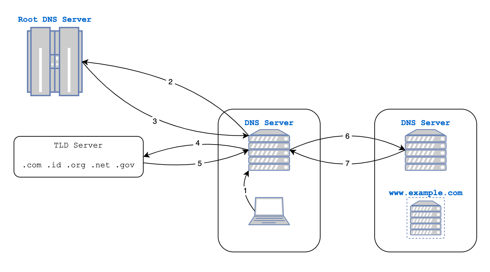

# Cara Kerja DNS

**DNS (Domain Name System)** adalah sistem yang berfungsi untuk menerjemahkan **nama domain** (seperti `www.example.com`) menjadi **alamat IP** (seperti `141.251.195.70`) yang dapat dimengerti oleh komputer. Berikut adalah langkah-langkah bagaimana DNS bekerja:

---

### 1. Pengguna Meminta Akses ke Nama Domain

Ketika pengguna mengetik nama domain (misalnya `www.example.com`) di browser atau menjalankan aplikasi yang membutuhkan akses internet, permintaan DNS dibuat.

### 2. Permintaan Dikirim ke Recursive Resolver
- Jika alamat IP tidak ditemukan di cache lokal, permintaan dikirim ke **Recursive DNS Resolver**.
  - Recursive Resolver adalah server yang bertugas mencari informasi alamat IP dari domain yang diminta.
  - Biasanya, resolver ini adalah milik penyedia layanan internet (ISP) atau penyedia DNS publik (misalnya, Google Public DNS).

### 3. Proses pencarian domain oleh Recursive Resolver
Recursive Resolver memulai query ke server DNS lainnya untuk menemukan alamat IP. 

---
 
 
 

## Tahapan Recursive Resolver DNS

Berikut adalah tahapan Recursive Resolver DNS yang dijelaskan berdasarkan diagram alur yang mencakup proses query ke berbagai server DNS untuk menemukan alamat IP domain yang diminta:

### 1. Permintaan dari Klien ke Recursive Resolver
- Komputer pengguna (klien) mengirim permintaan untuk domain tertentu, misalnya `www.example.com`, ke **Recursive DNS Resolver** (ditampilkan sebagai "DNS Server").
- Resolver bertugas mencari alamat IP domain yang diminta, baik dari cache atau melalui permintaan ke server DNS lainnya.

---

### 2. Query ke Root DNS Server
- Jika alamat IP tidak ditemukan di cache resolver, resolver mengirim query ke **Root DNS Server**.
- Root server tidak mengetahui alamat IP spesifik untuk domain yang diminta, tetapi memberikan referensi ke **Top-Level Domain (TLD) Server** yang sesuai berdasarkan ekstensi domain (misalnya, `.com`, `.id`, `.org`).

---

### 3. Query ke TLD Server
- Recursive resolver mengirimkan query ke **TLD Server** yang sesuai, misalnya `.com`.
- TLD server mengarahkan resolver ke **Authoritative DNS Server** yang menyimpan informasi untuk domain `example.com`.

---

### 4. Query ke Authoritative DNS Server
- Recursive resolver menghubungi **Authoritative DNS Server** untuk domain `example.com`.
- Server ini memiliki data lengkap tentang domain tersebut, termasuk alamat IP untuk subdomain seperti `www.example.com`.

---

### 5. Authoritative Server Mengembalikan Alamat IP
- Authoritative DNS Server memberikan alamat IP dari domain `www.example.com` kepada resolver.

---

### 6. Resolver Mengembalikan Alamat IP ke Klien
- Recursive resolver mengembalikan alamat IP yang ditemukan kepada komputer pengguna.
- Alamat ini disimpan sementara di cache resolver dan cache klien untuk mempercepat permintaan berikutnya.

---

### 7. Klien Terhubung ke Alamat IP
- Komputer pengguna menggunakan alamat IP tersebut untuk terhubung langsung ke server tujuan (`www.example.com`) melalui protokol **TCP/IP**.

---

## Alur dengan Cache (Opsional)
### Cache Klien:
- Sebelum menghubungi resolver, komputer klien memeriksa cache lokal.
- Jika alamat IP ditemukan di cache klien, proses selesai, dan alamat IP digunakan langsung.

### Cache Resolver:
- Resolver juga memeriksa cache sebelum memulai query.
- Jika alamat IP ditemukan di cache resolver, resolver langsung mengembalikannya ke klien tanpa query ke server DNS lain.

---
