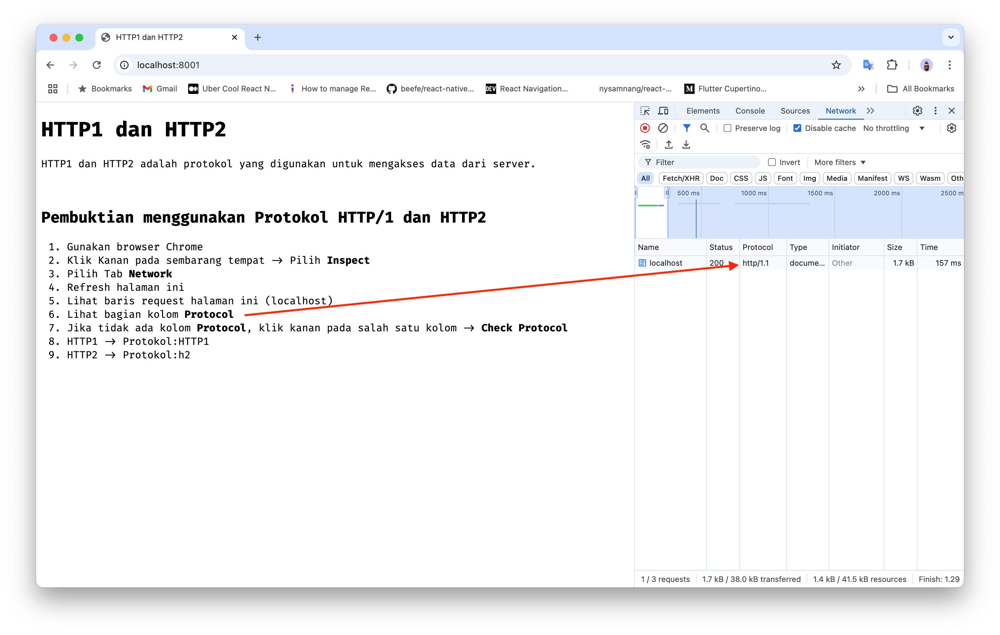

# HTTP/1 dan HTTP/2

## Persiapan
_Note: Direkomendasikan menggunakan UNIX OS_

### 🚀 Docker
1. Pastikan pada local machine sudah terinstall `docker` dan `docker-compose`
2. Jika belum, silakan download dan install pada situs resmi [Docker](https://www.docker.com/)

### 🔐 OpenSSL
1. Pastikan `openssl` sudah terinstall
2. Jika belum, silakan install sesuai dengan OS pada local machine

### 📂 Foldering
1. Buat folder project dan masuk ke dalam direktori folder project yang sudah dibuat
2. Buat folder `nginx-config` dan `ssl`

## Project

### 1. Nginx Configuration
1. Masuk ke folder `{root_project}/nginx-config`
2. Buat file `default.conf`
3. Masukkan kode berikut
```nginx
server {
  # HTTP/1.1 listen on port 80
  listen 80;

  # HTTP/2 listen on port 443 for SSL
  listen 443 ssl;
  http2 on;

  # OpenSSL
  ssl_certificate /etc/nginx/certs/server.crt;
  ssl_certificate_key /etc/nginx/certs/server.key;
  ssl_protocols TLSv1.3;
  ssl_prefer_server_ciphers off;

  # Security headers
  add_header X-Content-Type-Options nosniff;

  # Root directory of website on linux os
  root /var/www/;
  index index.html;
}
```
4. Save

### 2. Open SSL
1. Masuk ke folder `{root_project}/`
2. Buka terminal
3. Jalankan command
```zsh
openssl req -x509 -newkey rsa:2048 -keyout ssl/server.key -out ssl/server.crt -days 365 -nodes
```
4. Isi jawaban dari pertanyaan sesuai yang diinginkan


### 3. Docker Compose
1. Buat file `docker-compose.yml`
2. Masukkan kode berikut
```docker
version: '3.8'
services:
  web:
    image: nginx:alpine
    ports:
      - "8001:80" # HTTP/1.1
      - "443:443" # HTTP/2
    volumes:
      - ./nginx-config:/etc/nginx/conf.d
      - ./ssl:/etc/nginx/certs
      - ./index.html:/var/www/index.html
```
3. Save

## Test

1. Masuk direktory `{root_project}/`
2. Buka terminal
3. Jalankan command `docker-compose up`
4. Buka browser Chrome, akses localhost pada port 8001 [localhost:8001](http://localhost:8001)
5. Ikuti petunjuk dari web tersebut
6. Protokol HTTP/1 

<br>
<br>
7. Akses https://localhost untuk HTTP/2
8. Protokol HTTP/2

