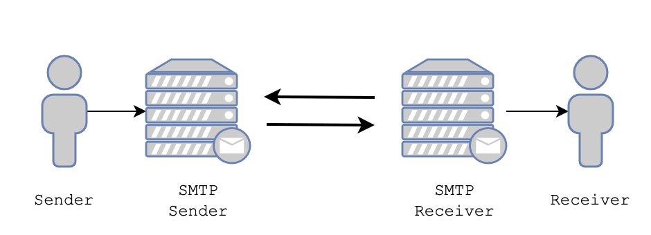
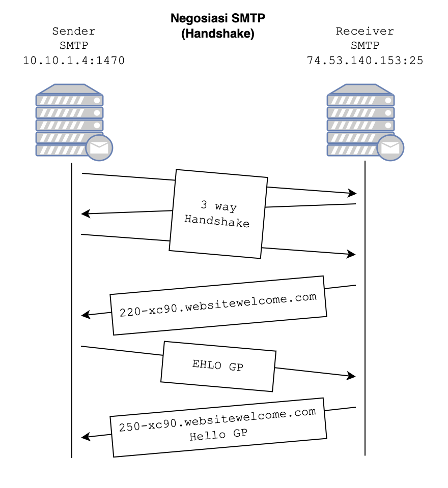
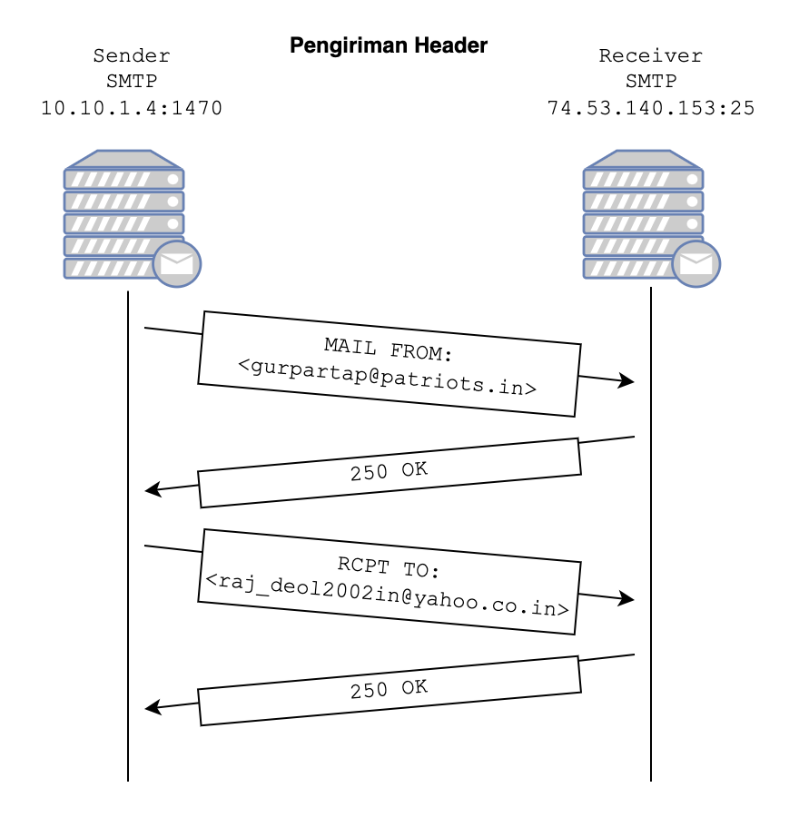
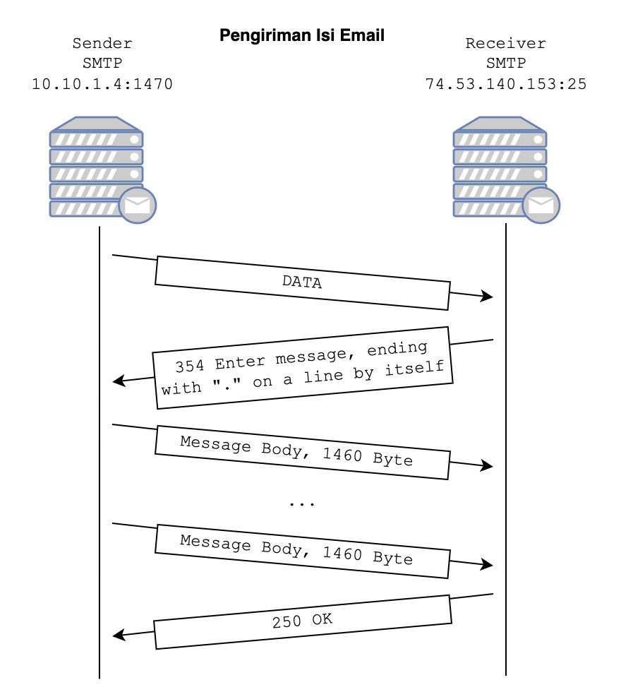
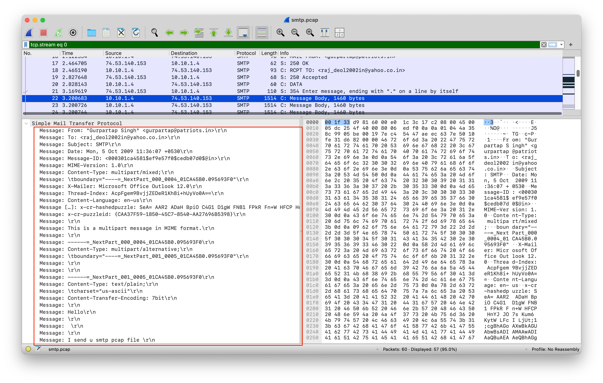
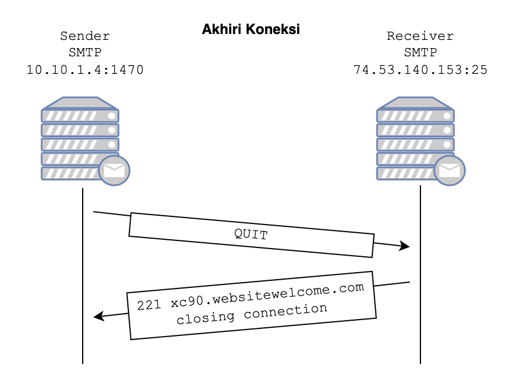

# Proses Kerja SMTP



### 1. Pengguna Mengirim Email:
- Pengguna menulis email melalui aplikasi email, dan aplikasi tersebut menghubungi server pengirim (Sender SMTP).

### 2. Sender SMTP Berkomunikasi dengan Receiver SMTP:
- **SMTP Commands/Mail**: Sender SMTP mengirimkan perintah SMTP beserta isi email (header dan body) ke Receiver SMTP.
- **Replies**: Receiver SMTP memberikan respons terhadap perintah yang dikirim oleh Sender SMTP (misalnya, konfirmasi berhasil diterima atau error jika terjadi kesalahan).

### 3. Receiver SMTP Mengirim ke File System dan Penerima:
- Setelah email diterima oleh Receiver SMTP, email disimpan di file system server.
- Penerima kemudian dapat mengakses email menggunakan aplikasi email.

## Proses Komunikasi antar SMTP

### 1. Inisiasi Koneksi & Handshake


- **Sender SMTP** memulai koneksi ke **Receiver SMTP** menggunakan protokol TCP (Transmission Control Protocol) pada port standar:

  - **Port 25**: Port default untuk komunikasi SMTP.
- Setelah koneksi TCP berhasil dibuka, Receiver SMTP mengirimkan pesan sambutan (greeting) sebagai tanda siap menerima email:
  - Respons: `220-xc90.websitewelcome.com`
- Sender SMTP mengirimkan perintah `HELO` atau `EHLO` untuk memperkenalkan dirinya kepada Receiver SMTP.
- Receiver SMTP me-response `250-xc90.websitewelcome.com Hello GP`

### 3. Pengiriman Header


1. Sender SMTP mengirimkan Command
```
MAIL FROM: <gurpartap@patriots.in>
```

2. Receiver SMTP me-response `250 OK`
3. Sender SMTP mengirimkan Command
```
RCPT TO: <raj_deo12002in@yahoo.co.in>
```
4. Receiver SMTP me-response `250 OK`

### 4. Pengiriman Isi Email


1. Sender SMTP mengirim Command `DATA`
2. Receiver me-response
```
354 Enter message, ending with "." on a line by itself
```
3. Sender SMTP mengirim isi email


4. Jika Sender SMTP sudah selesai menerima isi email, Receiver SMTP me-response `250 OK`

### 5. Akhiri Koneksi


1. Sender SMTP mengirimkan Command `QUIT`
2. Receiver SMTP me-response
```
221 xc90.websitewelcome.com closing connection
```
